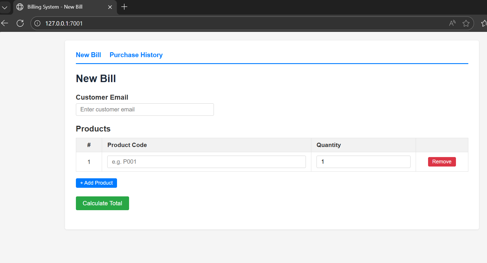
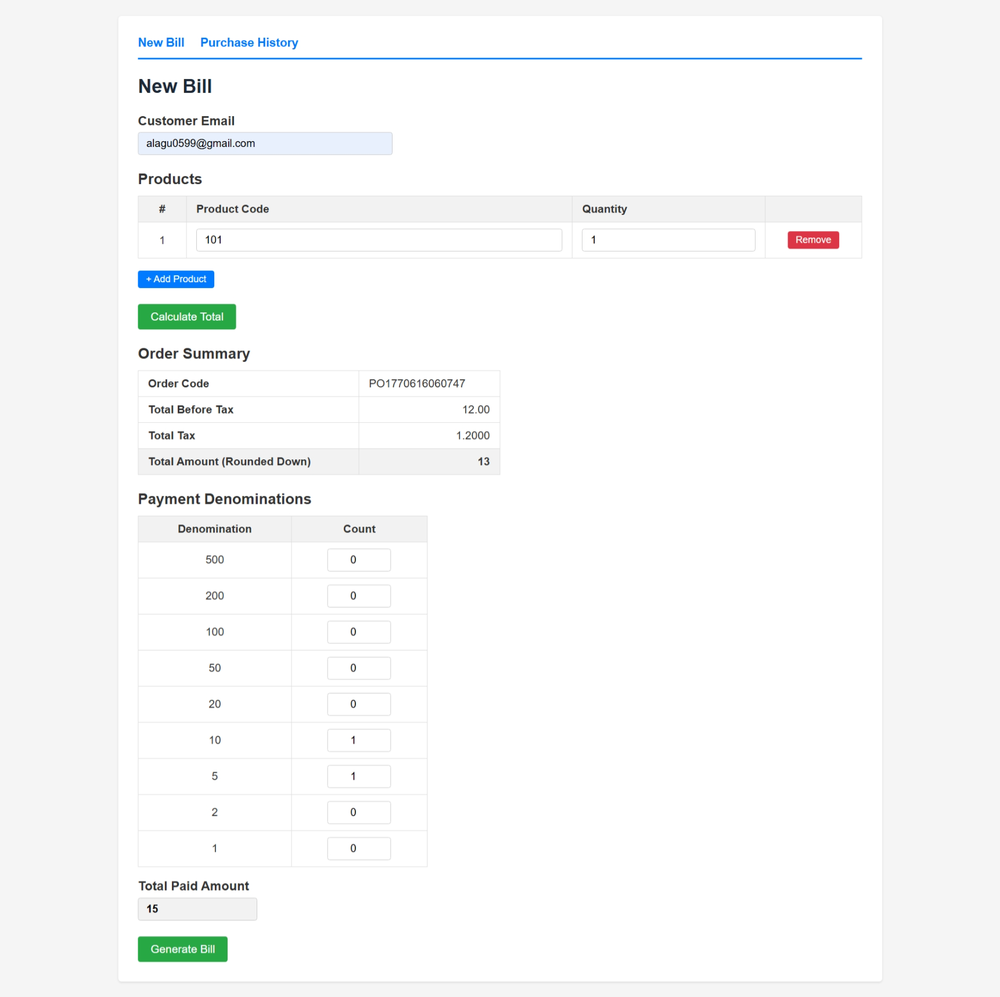
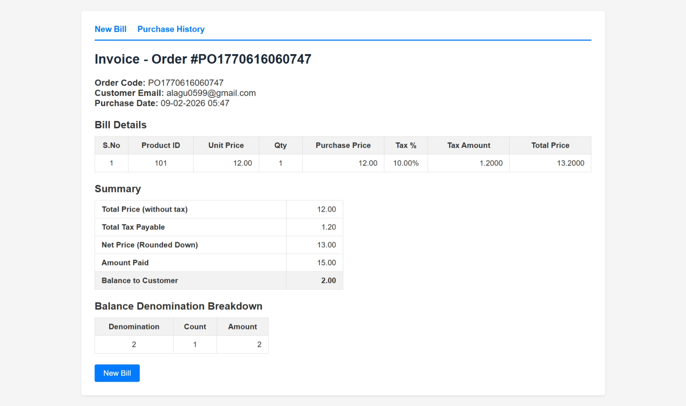
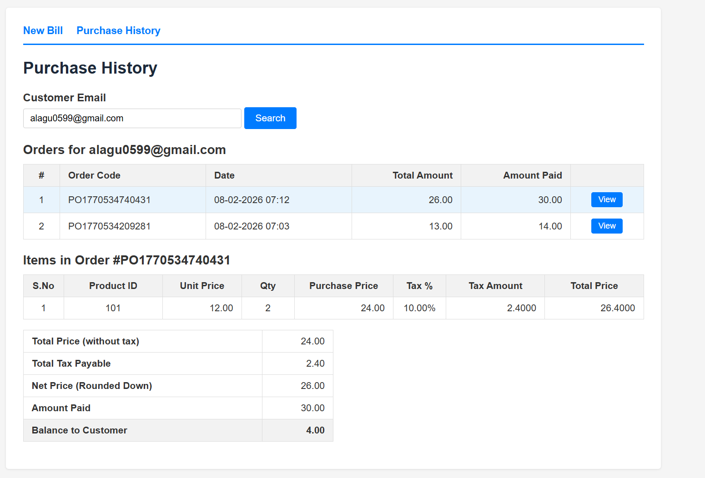
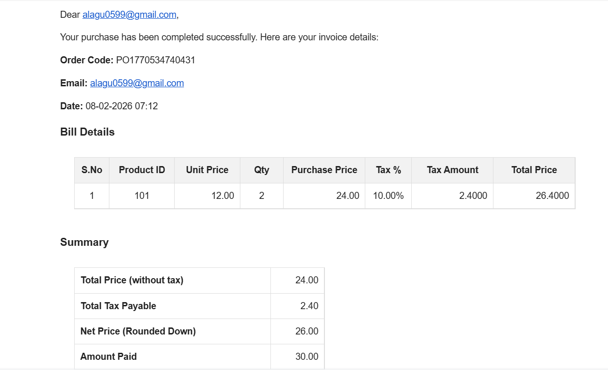

# Billing System

A simple Django billing application — manage products, generate bills with tax calculations, handle denomination-based change, and email invoices.

## Prerequisites

- Python 3.x
- PostgreSQL

OR

- Docker & Docker Compose

## Setup (Local)

1. **Clone and create virtual environment**

```bash
python -m venv .venv
.venv\Scripts\activate        # Windows
# source .venv/bin/activate   # Linux/Mac
```

2. **Install dependencies**

```bash
pip install -r requirements.txt
```

3. **Create `.env` file** in the project root with these variables:

```
# Secret Key
SECRET_KEY='django-insecure-8p#1wxu-!w-o3^)ez$wna^q#10se*-26rcp-a#tt2*f(^t5ahs'

# Database Config
DB_ENGINE="django.db.backends.postgresql"
DB_NAME="your db name"
DB_USER=" your username"
DB_PASSWORD="your password"
DB_HOST="db running host"
DB_PORT="db port"

# Email Config
EMAIL_HOST='smtp.gmail.com'
EMAIL_PORT=587
EMAIL_USE_TLS=True
EMAIL_HOST_USER='gamil id or username'
EMAIL_HOST_PASSWORD='password'
SERVER_EMAIL='gmail id'

# Value Config
VALID_DENOMINATIONS='1,2,5,10,20,50,100,200,500'

```

4. **Create the database** in PostgreSQL:

```sql
CREATE DATABASE billing;
```

5. **Run migrations**

```bash
python manage.py makemigrations billing
python manage.py migrate
```

6. **Create admin user**

```bash
python manage.py createsuperuser
```

7. **Run the server**

```bash
python manage.py runserver
```

## Setup (Docker)

1. **Create `.env` file** same as step 3 above, but set the database config to:

```
# Secret Key
SECRET_KEY='django-insecure-8p#1wxu-!w-o3^)ez$wna^q#10se*-26rcp-a#tt2*f(^t5ahs'

# Database Config
DB_ENGINE="django.db.backends.postgresql"
DB_NAME="your db name"
DB_USER=" your username"
DB_PASSWORD="your password"
DB_HOST="db running host"
DB_PORT="db port"

# Email Config
EMAIL_HOST='smtp.gmail.com'
EMAIL_PORT=587
EMAIL_USE_TLS=True
EMAIL_HOST_USER='gamil id or username'
EMAIL_HOST_PASSWORD='password'
SERVER_EMAIL='gmail id'

# Value Config
VALID_DENOMINATIONS='1,2,5,10,20,50,100,200,500'

```

> `DB_HOST=db` points to the Postgres container. The rest of the `.env` (email, denominations etc.) stays the same.

2. **Start everything**

```bash
docker-compose up --build
```

This starts PostgreSQL and the Django app together.

3. **Run migrations** (first time only, in a separate terminal)

```bash
docker-compose exec web python manage.py migrate
```

4. **Create admin user**

```bash
docker-compose exec web python manage.py createsuperuser
```

5. App is available at `http://localhost:8000`

To stop: `docker-compose down`

To stop and remove database volume: `docker-compose down -v`

## Seed Data

Go to Django admin at `http://127.0.0.1:8000/admin/` and add:

- **Products** — add products with code (e.g. P001), name, stock quantity, unit price, and tax percentage
- **Amount Denominations** — add denominations (500, 200, 100, 50, 20, 10, 5, 2, 1) with available counts

## How It Works

### Page 1 — Billing Form (`/`)

- Enter customer email
- Add products using "Add Product" button (enter product code + quantity)
- Click "Calculate Total" — this validates stock and shows the total
- Enter payment denominations (how many of each note/coin the customer is paying with)
- Click "Generate Bill" — validates change can be given, finalizes the order, and sends invoice email in the background





### Page 2 — Invoice (shown after Generate Bill)

- Shows itemized bill with unit price, quantity, tax breakdown per item
- Summary: total before tax, total tax, net price (rounded down), amount paid, balance
- Balance denomination breakdown (which notes/coins to return)



### Purchase History (`/history/`)

- Search by customer email to see all past completed orders
- Click "View" on any order to see its items and summary



### Email Notification

- Invoice is sent asynchronously to the customer's email after bill generation


